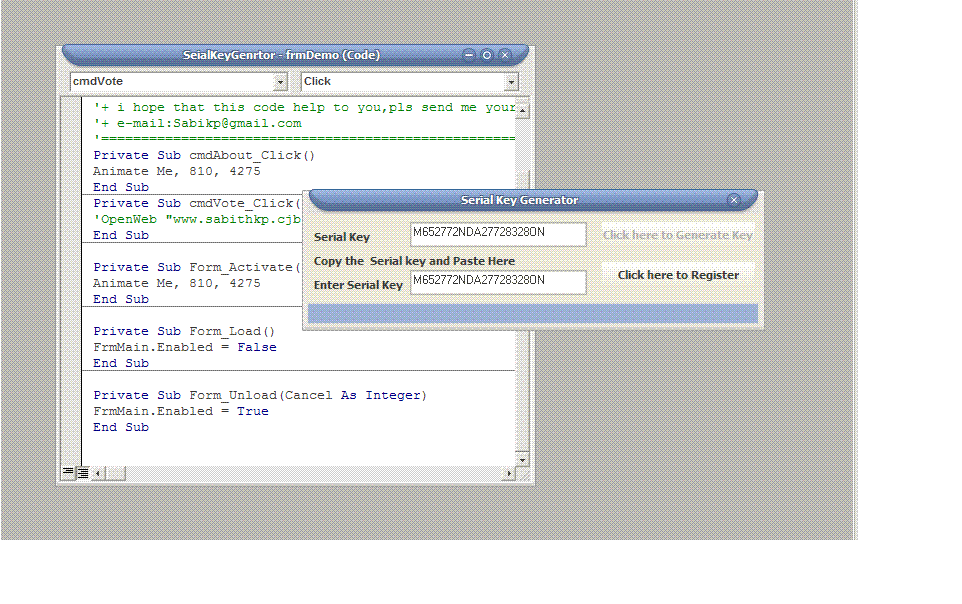



## Serial Key Generator

### Description

This code generate serial key from your computer depend on your hard Drive and this key stored in Database and Registry
 
### More Info
 
SerialKey

             |
---                |---
**Submitted On**   |2006-10-30 23:28:04
**By**             |[Sabith\.k\.p](https://github.com/Planet-Source-Code/PSCIndex/blob/master/ByAuthor/sabith-k-p.md)
**Level**          |Beginner
**User Rating**    |4.6 (32 globes from 7 users)
**Compatibility**  |VB 4\.0 \(16\-bit\), VB 5\.0, VB 6\.0, VBA MS Access
**Category**       |[Coding Standards](https://github.com/Planet-Source-Code/PSCIndex/blob/master/ByCategory/coding-standards__1-43.md)
**World**          |[Visual Basic](https://github.com/Planet-Source-Code/PSCIndex/blob/master/ByWorld/visual-basic.md)
**Archive File**   |[Serial\_Key20279710312006\.zip](https://github.com/Planet-Source-Code/sabith-k-p-serial-key-generator__1-66931/archive/master.zip)

